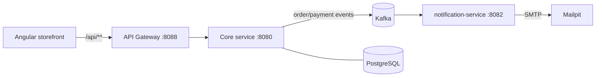

# Aurora Marketplace

Aurora Marketplace is a professional full-stack e-commerce portfolio project.

The goal is not to build a simple online shop, but a real-world e-commerce system with secure backend architecture, catalog, cart, checkout, admin tools, batch processing and AppSec-focused documentation.

It is built as an **event-driven platform**: a strong commerce core publishes
domain events to Kafka, an API gateway is the single entry point, and decoupled
microservices (starting with a notification service) react to those events. See
[docs/architecture/03_event_driven_microservices.md](docs/architecture/03_event_driven_microservices.md).



## Tech Stack

### Backend

- Java 21
- Spring Boot 3.5
- Spring Web
- Spring Security
- JWT authentication
- Spring Data JPA
- PostgreSQL
- Flyway
- Spring Batch
- Spring Validation
- Spring Actuator
- Spring Kafka (domain event publishing)
- Maven

### Microservices & Gateway

- Spring Cloud Gateway (single entry point, routing, CORS)
- Resilience4j circuit breaker + fallback
- Apache Kafka (KRaft) event backbone
- notification-service (event consumer → transactional email)

### Frontend

- Angular 21
- TypeScript
- Tailwind CSS
- Premium responsive UI/UX, dark mode, i18n (EN/ES), global search

### Infrastructure

- Docker Compose
- PostgreSQL
- Redis
- MinIO
- Mailpit
- Apache Kafka + Kafka UI

## Current Backend Status

Implemented MVP backend modules:

- Common API and error contracts.
- Global exception handling.
- JWT auth with register/login.
- Users with `CUSTOMER` and `ADMIN` roles.
- Catalog: categories, brands, products, variants and images.
- Inventory with stock movements.
- Cart, wishlist, reviews and coupons.
- Checkout from cart.
- Orders and order status history.
- Simulated payments.
- Audit logs.
- Admin dashboard summary.
- Admin inventory management.
- Spring Batch v1 jobs.

Also implemented:

- Angular 21 storefront + admin UI (premium design, dark mode, EN/ES, global search).
- Event-driven architecture: Kafka domain events + notification microservice.
- API gateway as the single entry point.

Not implemented yet:

- Real payment provider such as Stripe.
- Refresh tokens.
- Email verification.
- Password recovery.
- Orders shipping integrations.

## Local Services

| Service | URL / Port |
|---|---|
| API Gateway (entry point) | http://localhost:8088 |
| Backend (core) | http://localhost:8080 |
| notification-service | http://localhost:8082 |
| Frontend (dev) | http://localhost:4200 |
| PostgreSQL | localhost:5433 |
| Kafka (host listener) | localhost:29092 |
| Kafka UI | http://localhost:8081 |
| Redis | localhost:6379 |
| MinIO API | http://localhost:9000 |
| MinIO Console | http://localhost:9001 |
| Mailpit UI | http://localhost:8025 |
| Mailpit SMTP | localhost:1025 |

## Run Infrastructure

```powershell
# Infrastructure only (Postgres, Kafka, Redis, MinIO, Mailpit) — run apps locally:
docker compose up -d

# Or the full containerized stack (gateway + core + notification-service):
docker compose --profile apps up -d --build
```

## Run the Services Locally

```powershell
# Core commerce service
cd backend
.\mvnw.cmd spring-boot:run

# API gateway (new terminal)
cd gateway
.\mvnw.cmd spring-boot:run

# Notification microservice (new terminal)
cd services\notification-service
.\mvnw.cmd spring-boot:run

# Storefront (new terminal)
cd frontend
npm install
npm start                 # talks directly to the core on :8080
# To route the storefront through the gateway instead:
$env:AURORA_API_TARGET="http://localhost:8088"; npm start
```

## Configuration

JWT development defaults exist in `application.yml`. In production, override at least:

```powershell
$env:APP_SECURITY_JWT_SECRET="replace-with-a-real-secret-of-at-least-32-chars"
$env:APP_SECURITY_JWT_EXPIRATION_MINUTES="60"
```

Batch file locations can be overridden:

```powershell
$env:APP_BATCH_IMPORT_PRODUCTS_FILE="data/import/products.csv"
$env:APP_BATCH_SYNC_INVENTORY_FILE="data/import/inventory.csv"
$env:APP_BATCH_ABANDONED_CART_RETENTION_HOURS="24"
```

## Health Check

```text
GET http://localhost:8080/actuator/health
```

## Main Backend Endpoints

Public:

- `POST /api/auth/register`
- `POST /api/auth/login`
- `GET /api/categories`
- `GET /api/brands`
- `GET /api/products`
- `GET /api/products/search?q=term`
- `GET /api/products/{slug}`
- `GET /api/products/{productId}/reviews`
- `GET /actuator/health`

Customer:

- `GET /api/cart`
- `POST /api/cart/items`
- `POST /api/cart/apply-coupon`
- `POST /api/checkout/confirm`
- `GET /api/orders`
- `POST /api/payments/{orderId}/simulate`
- `GET /api/wishlist`
- `POST /api/products/{productId}/reviews`

Admin:

- `/api/admin/categories/**`
- `/api/admin/brands/**`
- `/api/admin/products/**`
- `/api/admin/inventory/**`
- `/api/admin/orders/**`
- `/api/admin/coupons/**`
- `/api/admin/reviews/**`
- `/api/admin/audit-logs`
- `/api/admin/dashboard/summary`
- `/api/admin/batch/**`

More detail: `docs/api/backend-endpoints.md`.

## Batch Jobs

- `importProductsJob`: imports catalog data from CSV.
- `syncInventoryJob`: updates inventory by SKU from CSV.
- `cleanAbandonedCartsJob`: removes old empty carts.

Batch CSV files are local and configurable through environment variables. Spring Batch metadata tables are managed by Spring Batch; Aurora also stores simplified job audit rows in `batch_job_audit`.
