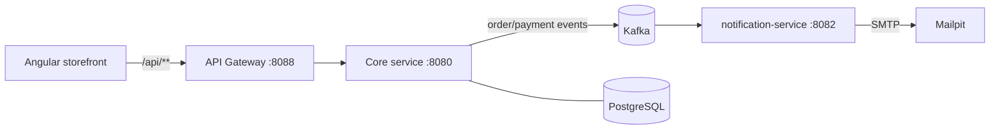

# Aurora Marketplace

[](https://github.com/JoseQuinteroDev/aurora-marketplace/actions/workflows/ci.yml)
[](https://github.com/JoseQuinteroDev/aurora-marketplace/actions/workflows/security.yml)
[](LICENSE)


Aurora Marketplace is a professional full-stack e-commerce portfolio project.

The goal is not to build a simple online shop, but a real-world e-commerce system with secure backend architecture, catalog, cart, checkout, admin tools, batch processing and AppSec-focused documentation.

It is built as an **event-driven platform**: a strong commerce core publishes
domain events to Kafka, an API gateway is the single entry point, and decoupled
microservices (starting with a notification service) react to those events. See
[docs/architecture/03_event_driven_microservices.md](docs/architecture/03_event_driven_microservices.md).



## Engineering highlights

The parts that make this more than a CRUD shop — each links to the deep dive:

- **Event-driven core with a Transactional Outbox** — business writes and their domain events
  commit in one DB transaction (no dual-write); a `@Scheduled` relay drains them to Kafka with
  `FOR UPDATE SKIP LOCKED` for safe multi-instance draining. See
  [event-driven docs](docs/architecture/03_event_driven_microservices.md).
- **At-least-once + idempotent consumers + DLTs** — the notification-service dedupes on `eventId`,
  retries with backoff, and routes poison messages to per-topic Dead Letter Topics.
- **Never trust the client** — prices, totals, stock, roles, ownership and authorization are always
  recomputed/reloaded server-side; the JWT `role` claim is **not** trusted (authorities reload from the DB).
- **Concurrency-correct checkout** — deterministic lock ordering to avoid deadlock, a pessimistic
  re-check under lock to prevent overselling, optimistic `@Version` locking on order/payment/inventory,
  and a per-user `Idempotency-Key` so a retried checkout never double-charges.
- **Defense-in-depth AppSec program** — a phased [security master plan](docs/appsec/security-master-plan.md)
  mapping every OWASP Top-10 risk to a control + a regression test + a detection signal, plus a deliberate
  [`vulnerable-lab`](docs/appsec/vulnerable-lab.md) teaching branch (exploit → remediate) and DevSecOps CI gates.
- **Edge resilience** — gateway with per-IP Redis rate limiting (tiered buckets), Resilience4j circuit
  breaker + timeouts, and a JSON fallback so a downed core degrades gracefully.

## Security highlights

- Stateless **JWT** (HS256, algorithm pinned) with authorities **reloaded from the DB**, not the token claim.
- **Refresh-token rotation with reuse detection** — opaque, single-use, SHA-256-at-rest, 15-min access TTL;
  reuse revokes the whole token family and denylists its access tokens.
- **Per-account login lockout**, **password reset** and **email verification** (anti-enumeration), and
  **breached-password rejection** via the HIBP range API (k-anonymity, fail-open).
- **TOTP MFA** cryptographic foundation (RFC 6238/4648 + AES-GCM) — login-path wiring in progress.
- Locked **CSP** + full security-header set on the core, mirrored onto gateway-originated responses.

See the **[AppSec program overview](docs/appsec/README.md)** and the
**[security-testing catalog](docs/appsec/security-testing.md)** (controls ↔ tests ↔ OWASP).

## Tech Stack

### Backend

- Java 21
- Spring Boot 3.5
- Spring Web
- Spring Security
- JWT authentication
- Spring Data JPA
- PostgreSQL
- Flyway
- Spring Batch
- Spring Validation
- Spring Actuator
- Spring Kafka (domain event publishing)
- Maven

### Microservices & Gateway

- Spring Cloud Gateway (single entry point, routing, CORS)
- Redis-backed per-client rate limiting, automatic retries, per-call timeouts
- Resilience4j circuit breaker + fallback
- Apache Kafka (KRaft) event backbone
- **Transactional Outbox** for reliable, consistent event publishing
- **Idempotent** consumers + **retry with Dead Letter Topics**
- notification-service (event consumer → transactional email)

### Observability

- Spring Boot Actuator health probes
- Micrometer + Prometheus metrics (`/actuator/prometheus`) on every service
- Micrometer Tracing (Brave) — `traceId`/`spanId` correlation in logs

### Frontend

- Angular 21
- TypeScript
- Tailwind CSS
- Premium responsive UI/UX, dark mode, i18n (EN/ES), global search

### Infrastructure

- Docker Compose
- PostgreSQL
- Redis
- MinIO
- Mailpit
- Apache Kafka + Kafka UI

## Current Backend Status

Implemented MVP backend modules:

- Common API and error contracts.
- Global exception handling.
- JWT auth with register/login.
- Users with `CUSTOMER` and `ADMIN` roles.
- Catalog: categories, brands, products, variants and images.
- Inventory with stock movements.
- Cart, wishlist, reviews and coupons.
- Checkout from cart.
- Orders and order status history.
- Simulated payments.
- Audit logs.
- Admin dashboard summary.
- Admin inventory management.
- Spring Batch v1 jobs.

Also implemented:

- Angular 21 storefront + admin UI (premium design, dark mode, EN/ES, global search).
- Event-driven architecture: Kafka domain events + notification microservice.
- Reliable eventing: transactional outbox (producer), idempotent consumers and
  retry + dead-letter topics (consumer).
- API gateway as the single entry point (rate limiting, retries, timeouts, circuit breaker).
- Observability: Prometheus metrics + distributed tracing across all services.

Auth & account security (OWASP A07):

- Refresh-token rotation with reuse detection (opaque, single-use, SHA-256-at-rest; 15-min access TTL).
- Per-account login lockout, token revocation/denylist, public logout for idle sessions.
- Self-service password reset and email verification (anti-enumeration; a verified email gates checkout).
- Breached-password rejection (Have I Been Pwned range API, k-anonymity, fail-open).
- TOTP MFA cryptographic foundation (login-path wiring in progress).

Data & business-logic integrity (OWASP A04):

- Server-side recomputation of all money/stock/discounts; optimistic `@Version` locking on
  order/payment/inventory; per-user checkout `Idempotency-Key`; atomic coupon redemption under a row lock.

Not implemented yet:

- Real payment provider (e.g. Stripe) — payments are simulated by design.
- MFA login-path wiring (TOTP crypto foundation is shipped; enrollment + challenge flow is the next step).
- Shipping/fulfilment integrations.

## Security & AppSec

Security is treated as a first-class concern, with a documented AppSec program
and an automated DevSecOps pipeline. Start with the
**[AppSec program overview](docs/appsec/README.md)**.

| Document | What it covers |
|---|---|
| [AppSec program](docs/appsec/README.md) | Security posture (implemented vs. gaps) and defense-in-depth. |
| [Threat model (STRIDE)](docs/appsec/threat-model.md) | Assets, trust boundaries, attack surface, and mitigations mapped to code. |
| [OWASP Top 10 coverage](docs/appsec/owasp-top-10.md) | Each 2021 risk mapped to controls, file references, and remediation status. |
| [Security controls](docs/appsec/security-controls.md) | Catalog of implemented controls and where each lives. |
| [Security testing](docs/appsec/security-testing.md) | Test strategy, shipped security tests, and a manual pentest checklist. |
| [Vulnerable lab](docs/appsec/vulnerable-lab.md) | Deliberately-vulnerable branch design — attack & remediate writeups. |
| [DevSecOps pipeline](docs/devops/cicd-security.md) | CI/CD security gates: SAST, SCA, secret scanning, IaC scan, SBOM. |
| [Vulnerability disclosure](SECURITY.md) | How to report a security issue. |

Automated on every push/PR via [GitHub Actions](.github/workflows/security.yml):
**CodeQL** (SAST), **Trivy** (dependency & IaC scanning), **Gitleaks** (secret
scanning, hard gate), **CycloneDX** (SBOM), plus **Dependabot** updates.
The security-critical controls are locked by regression tests catalogued in
[`docs/appsec/security-testing.md`](docs/appsec/security-testing.md) (each test mapped to its
control and OWASP category).

## Local Services

| Service | URL / Port |
|---|---|
| API Gateway (entry point) | http://localhost:8088 |
| Backend (core) | http://localhost:8080 |
| notification-service | http://localhost:8082 |
| Frontend (dev) | http://localhost:4200 |
| PostgreSQL | localhost:5433 |
| Kafka (host listener) | localhost:29092 |
| Kafka UI | http://localhost:8081 |
| Redis | localhost:6379 |
| MinIO API | http://localhost:9000 |
| MinIO Console | http://localhost:9001 |
| Mailpit UI | http://localhost:8025 |
| Mailpit SMTP | localhost:1025 |

## Run Infrastructure

```powershell
# Infrastructure only (Postgres, Kafka, Redis, MinIO, Mailpit) — run apps locally:
docker compose up -d

# Or the full containerized stack (gateway + core + notification-service):
docker compose --profile apps up -d --build
```

## Run the Services Locally

```powershell
# Core commerce service
cd backend
.\mvnw.cmd spring-boot:run

# API gateway (new terminal)
cd gateway
.\mvnw.cmd spring-boot:run

# Notification microservice (new terminal)
cd services\notification-service
.\mvnw.cmd spring-boot:run

# Storefront (new terminal)
cd frontend
npm install
npm start                 # talks directly to the core on :8080
# To route the storefront through the gateway instead:
$env:AURORA_API_TARGET="http://localhost:8088"; npm start
```

## Configuration

JWT development defaults exist in `application.yml`. In production, **activate the `prod` profile**
(`SPRING_PROFILES_ACTIVE=prod`) — it requires the secrets below from the environment with no dev
fallback and arms `JwtSecretValidator`'s fail-fast. Override at least:

```powershell
$env:SPRING_PROFILES_ACTIVE="prod"
$env:APP_SECURITY_JWT_SECRET="replace-with-a-real-secret-of-at-least-32-chars"
$env:SPRING_DATASOURCE_URL="jdbc:postgresql://<host>:5432/aurora_marketplace"
$env:SPRING_DATASOURCE_USERNAME="<user>"
$env:SPRING_DATASOURCE_PASSWORD="<password>"
# Access tokens are intentionally short-lived (15 min) and extended via refresh-token rotation.
# Override only if you have a reason to: $env:APP_SECURITY_JWT_EXPIRATION_MINUTES="15"
```

For the containerized stack, copy [`.env.example`](.env.example) to `.env` and
override the development defaults (credentials, JWT secret). `.env` is gitignored;
never commit real secrets — the CI secret scanner enforces this.

Batch file locations can be overridden:

```powershell
$env:APP_BATCH_IMPORT_PRODUCTS_FILE="data/import/products.csv"
$env:APP_BATCH_SYNC_INVENTORY_FILE="data/import/inventory.csv"
$env:APP_BATCH_ABANDONED_CART_RETENTION_HOURS="24"
```

## Health Check

```text
GET http://localhost:8080/actuator/health
```

## Main Backend Endpoints

Auth (public; anti-enumeration + rate-limited at the gateway):

- `POST /api/auth/register`
- `POST /api/auth/login`
- `POST /api/auth/refresh` — rotate the refresh token (reuse detection)
- `POST /api/auth/revoke` — idle-session logout
- `POST /api/auth/forgot-password` / `POST /api/auth/reset-password`
- `POST /api/auth/verify-email` / `POST /api/auth/resend-verification`

Public:

- `GET /api/categories`
- `GET /api/brands`
- `GET /api/products`
- `GET /api/products/search?q=term`
- `GET /api/products/{slug}`
- `GET /api/products/{productId}/reviews`
- `GET /actuator/health`

Customer:

- `GET /api/cart`
- `POST /api/cart/items`
- `POST /api/cart/apply-coupon`
- `POST /api/checkout/confirm`
- `GET /api/orders`
- `POST /api/payments/{orderId}/simulate`
- `GET /api/wishlist`
- `POST /api/products/{productId}/reviews`

Admin:

- `/api/admin/categories/**`
- `/api/admin/brands/**`
- `/api/admin/products/**`
- `/api/admin/inventory/**`
- `/api/admin/orders/**`
- `/api/admin/coupons/**`
- `/api/admin/reviews/**`
- `/api/admin/audit-logs`
- `/api/admin/dashboard/summary`
- `/api/admin/batch/**`

More detail: `docs/api/backend-endpoints.md`.

## Batch Jobs

- `importProductsJob`: imports catalog data from CSV.
- `syncInventoryJob`: updates inventory by SKU from CSV.
- `cleanAbandonedCartsJob`: removes old empty carts.

Batch CSV files are local and configurable through environment variables. Spring Batch metadata tables are managed by Spring Batch; Aurora also stores simplified job audit rows in `batch_job_audit`.
