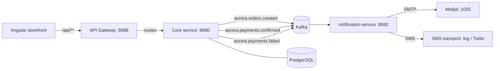

# Event-Driven Microservices

Aurora Marketplace is organized as an **event-driven platform** built around a
strong commerce core, an API gateway as the single entry point, and decoupled
microservices that react to domain events over Kafka.

This is a pragmatic decomposition: the transactional commerce domain (catalog,
cart, checkout, orders, payments) stays cohesive in one service that owns its
data, while genuinely independent concerns (notifications today; analytics,
fulfilment, search indexing tomorrow) are extracted as services that integrate
**only** through published events — never through a shared database or jar.

## Components

| Component | Tech | Port | Responsibility |
|---|---|---|---|
| API Gateway | Spring Cloud Gateway | 8088 | Single entry point, routing, CORS, circuit breaker + fallback |
| Core service (`backend`) | Spring Boot 3.5 | 8080 | Commerce domain; **publishes** domain events |
| notification-service | Spring Boot 3.5 | 8082 | **Consumes** events; sends transactional notifications by email or SMS |
| Kafka | Apache Kafka 3.9 (KRaft) | 29092 | Event backbone |
| Kafka UI | provectus/kafka-ui | 8081 | Topic / event / consumer-group inspection |
| Storefront | Angular 21 | 4200 | Customer + admin UI (enters via the gateway) |

## Event Flow



## Topics (the contract)

The integration contract is the **topic name + JSON shape** of each event.
There is deliberately no shared library: producer and consumers each own their
own event classes, and consumers ignore unknown fields so the contract can
evolve safely.

| Topic | Producer | Consumers | Trigger |
|---|---|---|---|
| `aurora.orders.created` | core | notification-service | Checkout confirmed |
| `aurora.payments.confirmed` | core | notification-service | Payment succeeded |
| `aurora.payments.failed` | core | notification-service | Payment failed |

Event records carry an `eventId`, `occurredAt`, the order identifiers, the
customer email/name and the relevant monetary fields — enough context for a
consumer to act without calling back into the core. They also carry the
customer's `customerPhone` and resolved `notificationChannel` (`EMAIL` or
`SMS`), so the notification-service can deliver on the channel the customer
chose. The channel is **resolved in the core** (it degrades `SMS` to `EMAIL`
when no phone is on file), so a consumer can trust it is always deliverable.

## Reliability

Delivery is **at-least-once**, end to end:

- **Producer — Transactional Outbox.** The core never writes to Kafka inside the
  commerce transaction. It records events to an `event_outbox` table in the same
  DB transaction, and a scheduled relay (`FOR UPDATE SKIP LOCKED`, multi-instance
  safe) publishes them. A broker outage delays delivery instead of losing events;
  a rolled-back checkout produces no event.
- **Consumer — Idempotent.** Each event carries an `eventId`. The
  notification-service skips ids it has already delivered, so a Kafka redelivery
  (rebalance, restart) never sends a duplicate notification. The chosen channel
  is the primary delivery: its failure propagates (retry → DLT) and the id is
  marked processed only once that channel actually accepts the message.
- **Consumer — Retry + Dead Letter Topic.** Transient failures (e.g. SMTP down)
  are retried with exponential backoff; a malformed/poison record is
  non-retryable. Exhausted or poison records are routed to `<topic>.DLT` for
  inspection and replay instead of being silently dropped or blocking the
  partition.

| Dead-letter topic | Source topic |
|---|---|
| `aurora.orders.created.DLT` | `aurora.orders.created` |
| `aurora.payments.confirmed.DLT` | `aurora.payments.confirmed` |
| `aurora.payments.failed.DLT` | `aurora.payments.failed` |

## Design Principles

- **No shared state.** Services integrate only through events. Each service owns
  its data (notification-service keeps an in-memory log of what it processed).
- **Single entry point.** The gateway centralizes routing, CORS, per-client-IP
  **rate limiting** (Redis-backed), automatic **retries** for idempotent GETs,
  per-call **timeouts** and a Resilience4j **circuit breaker** with a JSON
  fallback when a downstream is down. It routes `/api/notifications/**` to the
  notification-service and everything else under `/api/**` to the core.
- **Observability.** Every service exposes Prometheus metrics
  (`/actuator/prometheus`) and emits `traceId`/`spanId` in its logs via
  Micrometer Tracing.
- **Independent deployability.** Each service has its own Maven build and
  Dockerfile and can be scaled or released on its own.

## Running

```powershell
# Infrastructure only (run apps locally with mvnw / ng):
docker compose up -d

# Full containerized stack (gateway + core + notification-service + Kafka):
docker compose --profile apps up -d --build
```

When running apps locally, point each one at the broker exposed on
`localhost:29092` (the default). Inside the Docker network they use `kafka:9092`.

## Observability

- **Kafka UI** at <http://localhost:8081> — inspect topics, events and the
  `aurora-notification-service` consumer group.
- **Mailpit** at <http://localhost:8025> — see the emails the notification
  service produced.
- **GET** `http://localhost:8082/api/notifications` — the notification log.
- **Gateway** health at <http://localhost:8088/actuator/health>.
